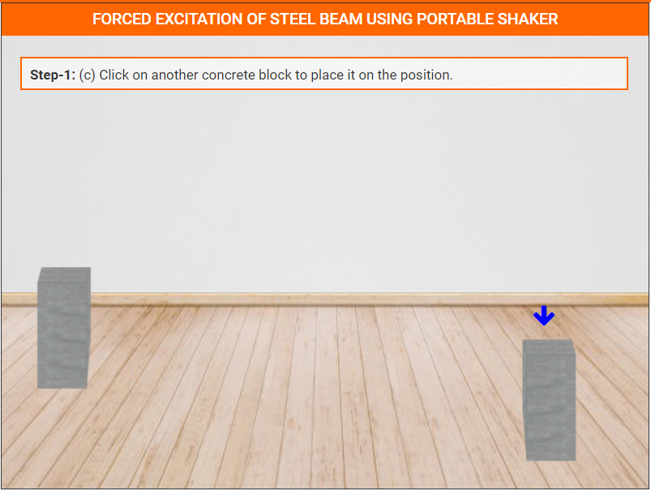
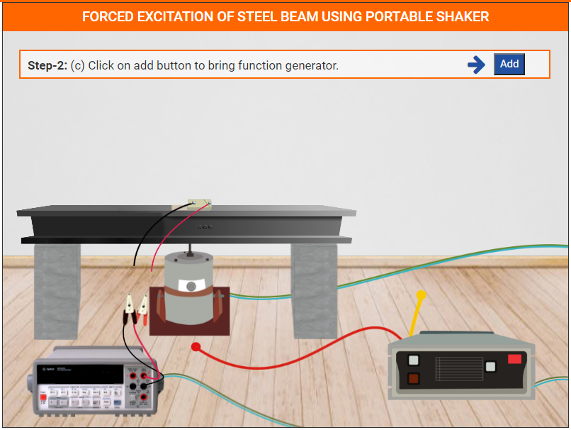

### These steps will be followed for the experiment

**PRE EXPRIMENT QUIZ QUESTIONS**
	
1) What is sweep signal?
2) What is time domain analysis?
3) What is frequency domain analysis?
4) What is the mathematical formula for natural frequency?
5) What is the range of sweep signal used in the experiment?

#### Preparation of specimens:

1. Click on Start Experiment button to start the experiment.

2. Click on Add Button to bring Concrete Blocks.

3. Click on Concrete Blocks one by one to place these on the position

4. Click on Add Button to bring Portable Shaker

5. Click on Portable Shaker to place it on the position.

6. Click on Add Button to bring Steel Beam.

7. Click on Add Button to bring Bond

8. Click on brush to apply bond on the Steel Beam.

9. Click on Add Button to bring PZT Patch.

10. Click on PZT Patch to fix it on the Steel Beam.

11. Click on Add Button to bring wires.

12. Click on Add Button to bring Soldering iron.

13. Click on wires one by one to place these on the PZT Patch

14. Click on PZT Patch for Zoom view.

15. Click on Soldering iron for soldering.

16. Click on Add Button to bring Digital Multimeter.

17. Click on Add Button to bring Amplifier.

18. Click on Add Button to bring Function Generator.

19. Click on yellow wire of Amplifier to attach it with the Function Generator.

20. Click on red wire of Amplifier to attach it with the Portable Shaker.

21. Click on both Clips one by one to attach with PZT wires.

22. Switch On the power button of Digital Multimeter.

23. Switch On the power button of Function Generator.

24. Select Time & No. of samples and click on Submit button.

25. Calculate the natural frequency theoretically and compare it with frequency obtained through this experiment.

**POST EXPRIMENT QUIZ QUESTIONS**

1) Plot the time domain data in excel to visualize the free damped
oscillations.

2) Using Matlab, covert the time domain data in the frequency domain and
identify the natural frequency of the beam.

3) Calculate the damping ratio using half power band method.
4) Compare the values of damping ratio obtained experimentally and
theoretically.
