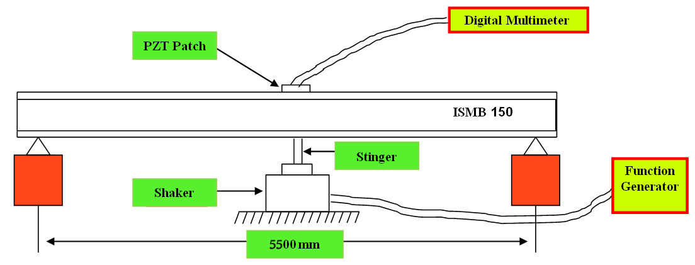
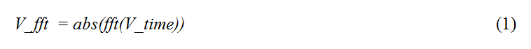
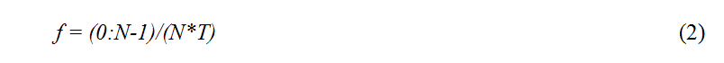
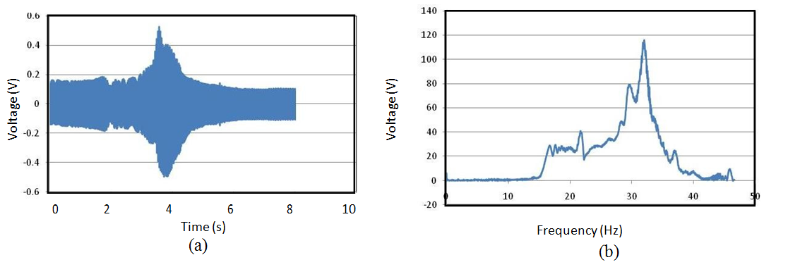
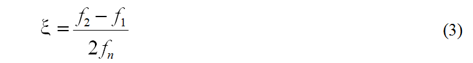
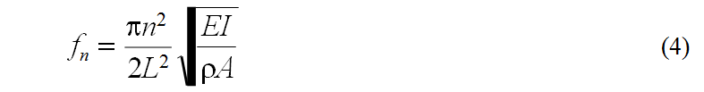

### Theory

The experimental setup is as shown in Fig. 1. It consists of a standard beam ISMB 150 of 3 m length, with a PZT sensor patch bonded on the top surface. The wires from the patch are connected to Agilent 34411A Digital Multi Meter (DMM) connected to the LAN port and thus accessible to the user through the internet/intranet. The beam is excited using series portable dynamic shaker. The input to the shaker is in the form of the sinusoidal signal generated by a function generator, which is amplified by an amplifier and converted to mechanical signal by the shaker.

The beam is excited into forced vibrations using a harmonic sweep signal in the frequency range 10-50 Hz over a time period of 20 seconds. As the beam vibrates, the surface strain fluctuates between compression and tension, thereby developing sinusoidally varying charge (and hence voltage) across the electrodes of the PZT sensor through the direct piezoelectric effect (for more details <a href="http://ssdl.iitd.ac.in/vssdl/piezo.pdf" target="_blank">click here</a>) to learn more about piezoelectricity. The instantaneous voltage developed across the piezoelectric sensor can be measured at the user specified time interval using the DMM. The VEE PRO based interactive dialogue box available in the main page of the experiment (for more details <a href="https://vssd-iitd.vlabs.ac.in/exp/portable-shaker/" target="_blank">click here</a>) can be used for this purpose. A sampling rate of 1 milli second and a total sampling time of 15 s (total 15, 000 measurements) is recommended for best results. The dialogue box stores the time and the frequency domain data in the computer of the user. Plots are also available in the VEE PRO dialogue box.

Fig. 1 Experimental set up 

The user may plot the time domain data in excel to visualize the oscillations more minutely. At the same time, through Fast Fourier Transform, the user can convert the time domain data (as a matrix of voltage output, V_time) in the frequency domain. If using MATLAB, following commands can be used:

This command will produce a matrix of voltage values in the frequency domain. The corresponding matrix of frequencies can be obtained using 

where N is the total number of samples in the time domain (here 10, 000) and T the sampling interval (here
0.001 second). It may be noted that the VEE PRO dialogue box also provides the matrix V_fft. The user may use it directly if MATLAB is not available. Fig. 2 shows typical time and frequency domain responses expected if the experiment is correctly performed.

 

Fig. 2 Expected sensor response (a) Time domain (b) Frequency domain

From the frequency plot, the user can identify the natural frequency of the beam as the frequency corresponding to which peak voltage response is observed (here around 32 Hz). The damping ratio can be calculated using the half power band method (Paz, 2004) as

where fn is the frequency corresponding to peak response and f1 and f2 represent the frequencies corresponding to 0.707 of the peak response (f2 > fn > f1). 
The user may compare the values obtained through this experiment with the damping ratio available from the literature and also the theoretical frequency given by (Paz, 2004).

where <i>E</i> denotes the Young’s modulus of elasticity of the beam, <i>ρ</i> the material density, <i>A</i> the cross sectional area, <i>I</i> the moment of inertia and <i>L</i> the length of the beam.
